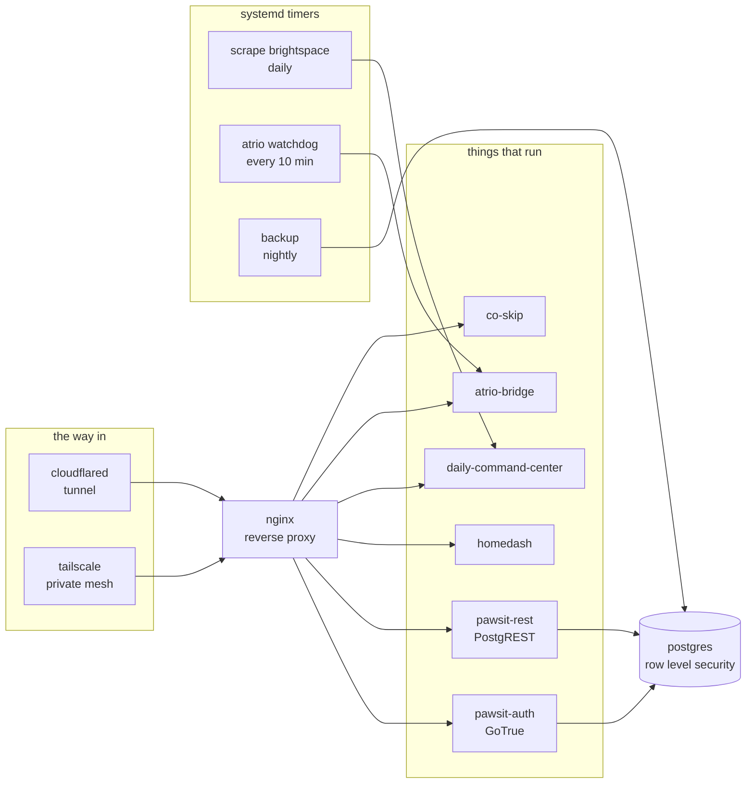

<picture>
  <source media="(prefers-color-scheme: dark)" srcset="https://raw.githubusercontent.com/luccahp1/luccahp1/main/assets/header-dark.svg">
  <source media="(prefers-color-scheme: light)" srcset="https://raw.githubusercontent.com/luccahp1/luccahp1/main/assets/header-light.svg">
  
</picture>

```console
you@luccas-site:~$ whoami

lucca prada - london, ontario
  work     backend + ai co-op at wsib, on the health-check automation platform
  building atrio and outpace, two ai tools for small service businesses
  school   computer programming & analysis at fanshawe, on a full scholarship
  stack    java / spring boot, python, next.js, claude api, one ubuntu closet
  site     luccahp1.github.io/portfolio

you@luccas-site:~$ _
```

I build small software for real businesses. The kind where the owner still picks up the
phone. Lately I have been teaching robots to pick it up politely instead.

---

## Things I wrote from scratch, with no dependencies

Four libraries with no third-party code in them, and none in their tests either. `javac` and
`java` are the entire toolchain, which means CI needs nothing but a JDK.

| | what it is | the interesting part |
|---|---|---|
| **[needle](https://github.com/luccahp1/needle)** | A regex engine. Parser, Thompson NFA construction, parallel state-set simulation. | `(a+)+b` against **50,000 characters in 6ms**. 4x the input costs 3.9x the time, because it cannot backtrack. |
| **[ledger](https://github.com/luccahp1/ledger)** | A crash-safe key/value store on a write-ahead log. | The crash tests tear real records in half on disk, flip real bits, and forge a record claiming a two billion byte key. |
| **[sluice](https://github.com/luccahp1/sluice)** | Five rate limiting algorithms behind one interface. | The token bucket is lock-free. Eight threads, 40,000 attempts, a burst of 100, and **exactly 100** get through. |
| **[quilt](https://github.com/luccahp1/quilt)** | Eight CRDTs, including an RGA sequence. Two replicas edit offline with no coordinator and end up byte-identical. | **49 tests, and I proved they work by breaking the library 11 times.** All 11 mutants died. Zero compiler warnings at `-Xlint:all`, CI on JDK 17, 21 and 24. |

There is also **[Khronos](https://github.com/luccahp1/Khronos)**, a C++20 multi-calendar date
library built on Julian Day Numbers, for when I want to be wrong in a different language.

<details>
<summary><b>How I know those tests are not decorative</b></summary>

<br>

A green test suite proves nothing until you have watched it go red for the right reason. So I
broke each library on purpose and reran:

Swapping `sluice`'s compare-and-set for a blind write:

```
FAIL  token bucket does not over-admit under 8-thread contention
      exactly 100 permits may be granted with a frozen clock (expected 100, got 142)
1 FAILED, 19 passed
```

Disabling `ledger`'s checksum:

```
FAIL  CORRUPTION: a flipped bit is caught by the checksum
1 FAILED, 18 passed
```

One test fails, everything else stays green. That is what tells you the failure is specific and
the test is actually load-bearing.

With `quilt` I stopped doing this by hand and ran the whole campaign: eleven realistic bugs, one
at a time, each one a mistake somebody could actually make.

| mutation | result |
|---|---|
| `GCounter` merges by sum instead of max | killed, 44/49 |
| `GSet` merges by intersection instead of union | killed, 47/49 |
| `LwwRegister` drops the replica tiebreak on equal timestamps | killed, 46/49 |
| `Rga` uses a per-replica counter instead of a Lamport clock | killed, 47/49 |
| `OrSet.remove` retires every dot, not just observed ones | **killed, 48/49** |
| ...and six more | all killed |

Eleven for eleven. The interesting row is the last one: a single test stood between that bug and a
green build, and it is exactly the add-wins property - the thing an example-based test would be
least likely to think to cover. That one test is the reason I trust the other forty-eight.

</details>

<details>
<summary><b>A claim I tried to make, and could not</b></summary>

<br>

`needle`'s README was going to end the way every article on this topic ends: with the same
pattern hanging `java.util.regex` forever.

I wrote that test. It failed. On JDK 24 the textbook ReDoS inputs finish **instantly**, because
modern JDKs notice that `(a+)+b` requires a trailing `b`, see that the input has none, and refuse
the work. I probed eighteen classic catastrophic patterns, including ones with no fixed suffix so
that optimisation could not fire. None of them blew up.

So the README says the true thing instead: the JDK is fast because of **heuristics**, which have
edges. This is fast because of its **structure**, which does not. Where both finish, the gap is
still 312x.

Shipping the folklore version would have been easier and would have survived exactly one
interviewer with a laptop.

</details>

---

## The closet

`luccaserver` is an Ubuntu box in my closet. Everything I build eventually moves in, which means
I have broken and repaired my own DNS, TLS, reverse proxy and unit files enough times to be
genuinely useful with them.



`pawsit.ca` is served from that box through a Cloudflare Tunnel, with real Postgres row-level
security behind it. Uptime is a collaboration between me and the power grid.

---

## The day job

**IT Solution Delivery Co-op, Technology** at the **Workplace Safety and Insurance Board**,
London ON, May 2025 to present, across consecutive terms.

- Backend work on WSIB's health-check automation platform in **Java, Python, Spring Boot** and
  Spring Boot Admin
- Secure HTTP request handling with **JWT tokens and cookies** in enterprise systems
- Led the hands-on side of an **iText PDF library upgrade**: read the legacy modules, fixed the
  breaking changes, ran the regression tests
- Debugged and refactored legacy Java for reliability and readability
- Recipient of the **WSIB Scholars Award**, a full scholarship

---

## Products I own end to end

**Atrio** is an AI front desk. A phone receptionist that learns a business by reading its
website, then answers calls like it has worked there for years. No menus, no "press 2". It
started on a hosted voice platform and now runs on a bridge I wrote instead: G.711 audio
streamed untranscoded between SignalWire and an Inworld speech-to-speech session, about
640-820 ms from the caller talking to it talking back. Untranscoded is the point: the audio never
becomes text and back again, which is the round trip most voice stacks pay for twice.

The reading-the-website part is a Claude API distiller: it crawls a client's site and builds the
answer set the agent works from, which is also where I learned to check a model's output instead
of trusting it. It once truncated a fact mid-sentence, and a truncated fact is worse than a
missing one, because the agent will confidently finish the thought itself.

It lives on my own Ubuntu box under systemd, behind a 20-check preflight and a watchdog that
probes the live call path every 10 minutes, because the number once went quiet for five days and
nothing alerted me.
`node` `signalwire` `inworld` `claude api` `websockets`

**Outpace** is speed-to-lead. It answers a business's new leads within minutes, in the owner's
own voice, and keeps following up until a human replies. Built for trades that leak leads on
nights and weekends, because the first company to answer usually wins the job. 40 unit tests, and
parked on purpose - one product at a time gets my evenings, and right now that is Atrio.
`next.js` `claude api` `libsql`

Both are mine end to end: product design, unit economics, code, deploy, and the 2am when
something breaks.

**PawSit** is a live pet-sitting marketplace for London, Ontario. Fee-free on purpose: in a city
that finds sitters by word of mouth, charging on day one just gives people a reason to keep
using e-transfer. Report cards after every visit are the moat.

---

## The stack, honestly

| | |
|---|---|
| **languages** | Java, Python, JavaScript/TypeScript, SQL, C++ |
| **backend** | Spring Boot, Spring Boot Admin, REST, MVC, JWT/cookie auth, Node, Next.js |
| **ai** | Claude API, realtime speech-to-speech voice, prompt and agent design, cost and limit engineering |
| **frontend** | React/Next.js, Tailwind, and a lot of plain handwritten CSS |
| **data & ops** | Postgres, MySQL, SQLite/libSQL, Ubuntu, nginx, systemd, Tailscale, ngrok, Vercel |
| **practices** | Agile, debugging other people's legacy code, technical writing, regression testing |

---

## Worth clicking

**[luccahp1.github.io/portfolio](https://luccahp1.github.io/portfolio/)** is my portfolio,
written by hand. No framework, no template, no build step. It remembers your visits, lets you
draw on it, prints itself as my resume with <kbd>ctrl</kbd>+<kbd>p</kbd>, and hides a working
terminal behind the <kbd>/</kbd> key.

<details>
<summary><b>There are secrets in it. Here are two.</b></summary>

<br>

The lamp cord in the top right is a real Verlet rope. Grab it and pull in any direction and it
stretches. Keep yanking past the warning and it snaps, with sparks. Break it a second time after
the repair and I stop being nice: duct tape, a real wall switch, and zero physics until you type
`rewire`.

The site also records your cursor, locally, and never sends it anywhere. Come back tomorrow and
you can watch yourself drift across the page, labeled "you, 1 day ago".

The rest are listed at the bottom of the page, but `cat secrets.txt` in the terminal hits
different.

</details>

<br>

> The header up top is hand-drawn SVG committed to this repo, not a stats widget. The cord sways,
> and it stops swaying if you have asked your OS for reduced motion.

---

**[luccaprada25@gmail.com](mailto:luccaprada25@gmail.com)** - I read everything, and I reply.
